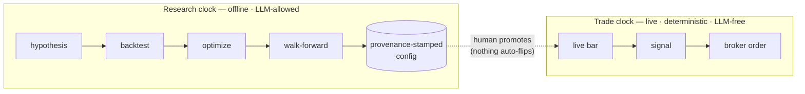

# TradeFlow

[](https://github.com/makedirectory/tradeflow/actions/workflows/ci.yml)
[](https://tradeflow.mk-dir.com/)

A small, **layered**, **broker-agnostic** algorithmic-trading **research
engine** — and an honest one, which mostly means it's very good at telling you
your brilliant strategy is actually noise. It scans markets, tests strategies,
validates them out-of-sample, allocates portfolios, and exposes the whole
research surface to AI agents **without ever handing them order-execution
authority**. It ships with an [Alpaca](https://alpaca.markets) adapter, but
everything above the broker layer is vendor-neutral.
It scans a universe of symbols, runs a strategy over them, and either **backtests**
on history or **trades live** (paper by default) — with optional **parameter
optimization**, **walk-forward validation**, and **constraint-solver portfolio
allocation**.

Full docs — usage guide, engineering wiki, and
[changelog](https://tradeflow.mk-dir.com/changelog) — live at
**[tradeflow.mk-dir.com](https://tradeflow.mk-dir.com/)**.

> Making money in markets is genuinely hard. This project won't change that — but
> it will at least stop you from fooling yourself quite so quickly, which is most
> of the battle.

Designed to be easy to try and easy to read:

- **No TA-Lib / no native build step** — indicators are pure pandas/numpy, so
  `uv sync` is all you need and the Docker image carries no compiler toolchain.
- **Broker-agnostic** — everything is written against a `Broker` /
  `MarketDataProvider` interface. Alpaca is the first implementation; dropping in
  another venue means writing one adapter, nothing else.
- **Strict separation of concerns** — each layer does one job (see below).

> ⚠️ Educational software. Trading is risky; use paper trading. No warranty.


*`make demo` runs the whole pipeline on synthetic data (no keys, no network) and
renders this: a strategy that looks profitable in-sample, and the out-of-sample
verdict that calls it noise. The refusal is the product. The same panels render
for any run — pass `--chart PATH` to `backtest` or `walkforward`.*

## The mental model: two clocks

The one idea that explains everything else — TradeFlow runs on **two clocks that
never touch**:

- **Research clock** (offline, slow, exploratory): backtest → optimize →
  walk-forward, plus the optional AI agent. Non-determinism and LLMs are allowed
  here. It only ever *proposes* — writing provenance-stamped configs to disk.
- **Trade clock** (live, deterministic, LLM-free): `live bar → signal → order`.
  No model sits in the order path, so there's nothing to prompt-inject and nothing
  non-deterministic to debug when real money is at stake.

**Promotion is a manual human step** — automation never flips `PAPER_TRADE` or
places an order. The [MCP server](#agent-integration-mcp) enforces this
*structurally*: it builds only a data client, so it physically cannot trade. See
the [architecture docs](https://tradeflow.mk-dir.com/engineering/architecture)
for the full picture.

## Requirements

You need **either** of these — not both:

- **[uv](https://docs.astral.sh/uv/getting-started/installation/)** — the Python
  package manager used to run everything locally, **or**
- **[Docker](https://docs.docker.com/get-docker/)** — to build and run the app in
  a container (no local Python or uv needed).

The `Makefile` targets run through **uv** (e.g. `make backtest` → `uv run …`), and
there are separate **Docker** targets (`make docker-build`, `make docker-run`).
Pick whichever you prefer.

Either way you'll need free Alpaca **paper-trading** API keys from the
[Alpaca dashboard](https://app.alpaca.markets/) → *Paper Account → API Keys*.

## Quickstart (install it)

No clone needed — install the command and run the offline demo:

```bash
uv tool install tradeflow-engine        # or: pipx install tradeflow-engine
tradeflow demo                          # full pipeline on synthetic data, no keys
tradeflow init                        # add your free Alpaca paper keys when ready
tradeflow verdict --symbols NVDA,AAPL,META --start 2024-01-01 --end 2024-12-31
```

Optional capabilities are extras: `uv tool install "tradeflow-engine[viz,store]"`.

**→ [Getting started](https://tradeflow.mk-dir.com/usage/getting-started)** walks the
whole path: install → keys → your first real result → Claude connected. Six steps,
the first two with no keys and no network.

The distribution is **`tradeflow-engine`** (the bare `tradeflow` on PyPI is an
unrelated package); the command and the importable package are both `tradeflow`.

State (the research journal, trial store, bar cache, promoted configs) lives in
`~/.tradeflow` for an installed copy, or in the repo when you run from a checkout.
`tradeflow --version` prints which copy is running and where its state is; override
with `TRADEFLOW_HOME`.

## Quickstart (from a checkout)

```bash
# 1. Install uv:  https://docs.astral.sh/uv/
# 2. Install dependencies
make install                          # uv sync

# 3. See it work — no keys, no network
make demo                             # full pipeline on synthetic data + verdict

# 4. Point it at real data: guided setup for your free Alpaca paper keys
make init                             # writes .env, checks the keys, says what's next
                                      # (make check re-runs the diagnostics any time)

# 5. Try it (preconfigured combos)
make scan                             # which symbols are flagged right now?
make backtest                         # scan -> demo strategy -> report
make live                             # paper-trade the scanned universe
```

## Docker (a local dev stack, not an easier install)

Docker is itself a prerequisite, so `uv tool install` above is the simpler way to
just try this. What compose adds is a long-running MCP server and docs site with
state on named volumes that survives container replacement:

```bash
make up                               # MCP + persistent state. Never starts trading.
make down                             # stop; your trial history survives

docker compose run --rm demo          # offline, no keys
docker compose run --rm verdict --symbols NVDA,META --start 2024-01-02 --end 2024-04-01
```

`live` is profile-gated and is never started by `up` — turning the machine on must
not turn trading on. See [Running in Docker](https://tradeflow.mk-dir.com/usage/docker).

Run `make help` to see every target. Anything is overridable inline:

```bash
make backtest SYMBOLS=AAPL,MSFT,NVDA START=2024-06-01 END=2024-09-01 CAPITAL=50000
```

Or call the CLI directly:

```bash
uv run python main.py backtest --strategy demo_trend --scanner demo_volume \
    --symbols NVDA,META,TSLA --start 2024-01-02 --end 2024-04-01
```

## See it run

`make demo` runs the entire pipeline on a seeded random walk — no keys, no
network — and ends in a promotion verdict. The point isn't a winning strategy;
it's that the **refusal to promote a noise strategy is the product**:

```text
$ make demo

======================================================================
  TradeFlow demo — synthetic data, no API keys, no network
  (a seeded random walk: realistic-looking, no actual edge)
======================================================================

1) In-sample backtest of every registered strategy
   In-sample, almost anything looks tradeable. That's the trap.

   STRATEGY        RETURN   SHARPE  TRADES
   ---------------------------------------
   demo_trend      14.74%     0.48      45

2) Walk-forward validation of 'demo_trend' (the honest scorecard)
   Optimize in-sample, score out-of-sample across folds, then gate it.

   OOS Sharpe (median): -0.26   efficiency (OOS/IS): -0.17   OOS trades: 25

   Promotion gates:
     [FAIL] oos_sharpe:                  -0.26  (threshold 1.20)
     [FAIL] oos_profit_factor:            0.74  (threshold 1.30)
     [FAIL] walk_forward_efficiency:     -0.17  (threshold 0.40)
     [PASS] oos_drawdown_vs_is:          10.59  (threshold 13.94)
     [FAIL] min_oos_trades:              25.00  (threshold 100.00)
     [FAIL] deflated_sharpe:              0.00  (threshold 0.50)

   Verdict: NOT promotable

   No edge in a random walk → the gates refuse to promote it. That refusal
   is the product. Point TradeFlow at real data:
     tradeflow init       add your free Alpaca paper keys
     tradeflow verdict    then run the whole pipeline on real market data
```

That is one strategy because a bare install ships one. Anything you install
alongside it appears in the same table, scored the same way.

Notice the arc: `demo_trend` looks tradeable in-sample (+14.7%, Sharpe 0.48), but
once it's optimized in-sample and scored **out-of-sample** the edge evaporates
(median OOS Sharpe −0.26) and all but one promotion gate fails. That's
[walk-forward validation](https://tradeflow.mk-dir.com/engineering/walk-forward)
doing its job.

### Watching the agent get told "no"

`make demo` makes the point on synthetic data, where the refusal is easy — there
was never any edge to find. The harder and more useful question is what happens
when a proposal *does* look good. `make demo-agent` runs one full research
session on **real market data** and narrates every guardrail as it fires:

```text
$ make demo-agent

  ── Round 1 ────────────────────────────────────────────────────
     Hypothesis  Caching the processed universe to local disk lets the
                 strategy reuse warm state across sessions...
     Sandbox     REJECTED — generated code may not import 'os'
                 ↳ no bars loaded, no backtest run, no trial consumed

  ── Round 2 ────────────────────────────────────────────────────
     Sandbox     REJECTED — MultiFactorConfluenceStrategy has 8 searchable params (cap 5)

  ── Round 4 ────────────────────────────────────────────────────
     Proposal    [code] new strategy implementation
     Sandbox     ADMITTED — imports clean, contract valid, params within cap
     Walk-forward  in-sample Sharpe   2.04   →   out-of-sample   1.39   (efficiency 0.76)
     Multiple-testing correction applied over 37 trials
     Promotion gates:
       [PASS] oos_sharpe                     1.39   threshold 1.00
       [PASS] oos_profit_factor              1.92   threshold 1.30
       [PASS] walk_forward_efficiency        0.76   threshold 0.40
       [FAIL] oos_drawdown_vs_is             0.18   threshold 0.09
       [FAIL] min_oos_trades                 52.00  threshold 100.00
       [PASS] deflated_sharpe                0.58   threshold 0.50
     Verdict     NOT promotable — discarded
```

That last round is the one worth dwelling on. The strategy is *not* noise: it
survives out-of-sample with a Sharpe of 1.39 and clears four of six gates. It is
refused anyway, because 52 out-of-sample trades is too small a sample to
distinguish skill from luck and its drawdown degraded relative to in-sample. A
research engine that only rejects obvious garbage is not doing anything for you;
the interesting behavior is rejecting things that look good.

By default the proposals are **replayed** from a fixed set, so the run is
deterministic and needs no LLM API key — only Alpaca market-data keys. Point it
at a live model to watch it improvise instead:

```bash
make demo-agent                            # replayed proposals, deterministic
make demo-agent-live                       # live Claude proposer (needs ANTHROPIC_API_KEY)

uv run python main.py demo-agent --symbols NVDA,AAPL,META --provider ollama
```

Real market data means real variance: the exact Sharpes and which gates fail will
differ with the universe and date range you point it at. The shape — proposals
rejected before evaluation, survivors gated on out-of-sample evidence, nothing
promoted automatically — is what stays constant.

## What it does

| Command | What happens |
|---------|--------------|
| `demo` | Run the whole pipeline on **synthetic data** — no keys, no network — ending in an honest promotion verdict |
| `demo-agent` | Narrate one AI research session on **real market data**: proposal → sandbox → walk-forward → gates → holdout |
| `init` | Guided first-run setup: write a valid `.env` with hidden prompts, validate the keys against Alpaca via the data-only client, confirm paper trading, optionally warm the cache. `--check` is a doctor that writes nothing |
| `scan` | Run the universe scanner and print flagged symbols |
| `verdict` | The whole cross-sectional pipeline in one command — scan → alphas → portfolio → information over one universe, one window, one cost model — ending in one gate-derived verdict (read-only) |
| `backtest` | Scan → run a strategy over history → performance report |
| `live` | Scan → warm up indicators → stream bars → place paper/live orders. Bar-quality guards (staleness, spikes, inconsistent OHLC, out-of-order) veto bad bars — rejecting, never repairing — and a position ledger records intent vs. observed fills |
| `reconcile` | Check the position ledger against the broker's actual account state. Reports divergence; never corrects it (read-only) |
| `halt` / `resume` / `halts` | Stop opening new positions, and say so durably — a running engine sees it on the next bar. Blocks entries, never exits, so it can't trap the book |
| `flatten` | Emergency: halt, cancel every order, close every position. Goes straight to the broker, so it works when the engine is wedged |
| `optimize` | Search strategy parameters by backtest objective (grid / random / Bayesian); `--workers N` evaluates candidates in parallel — wall-clock only, same trials and same winner |
| `allocate` | Weight a portfolio: scalar-score sizing (OR-Tools), or `--objective utility` for mean-variance construction from alpha + Σ |
| `alphas` | Rank a universe by continuous alpha — a comparable, annualized residual-return forecast per name; `--combine` blends several signals, `--neutralize-factors` regresses out the risk model's factor exposures (read-only) |
| `risk` | Estimate the universe covariance Σ (Ledoit–Wolf shrinkage) and summarize its risk structure (read-only) |
| `info` | Information report: measure IC, breadth, and predicted-vs-realized IR — skill vs luck (read-only) |
| `--html PATH` | On `verdict`/`backtest`/`walkforward`/`info`: write a self-contained HTML report of the run — inline charts, zero external requests, provenance and honesty warnings first-class |
| `horizon` | Measure alpha decay / half-life; recommend rebalance cadence + current/lagged blend (read-only) |
| `walkforward` | Out-of-sample validation: optimize in-sample, score out-of-sample across folds, with a sacred holdout and promotion gates |
| `trials` | Browse the campaign's memory: `list` (filters, sorting, paging), `show` (one trial in full), `best` (a DSR-ranked leaderboard that always shows the family's `n_trials`) — read-only |
| `mcp` | Serve TradeFlow over MCP so an agent (Claude Code / Desktop) can drive verdict/scan/backtest/optimize/walk-forward/alphas/risk/portfolio/info — read-only, no live trading |

One strategy ships, and it is a demonstration rather than a candidate:

- **`demo_trend`** — long-only EMA trend follower: the normalized fast−slow gap,
  whose sign crossings are the golden / death cross (daily). Paired with the
  `demo_volume` scanner.

It exists so `tradeflow demo` has something to run and so the interface has a
worked example, not because it is an edge — the demo above spends its whole output
showing that it is not. **The strategies you would actually trade go in your own
package**, installed beside the engine and discovered by entry point, which keeps
them out of this repository entirely.

Each strategy defines a single continuous **score** (its conviction); the trade
clock's `BUY/SELL/HOLD` and the
[continuous alpha](https://tradeflow.mk-dir.com/engineering/alphas) are both
derived from it — one source of truth.

`examples/my-signals` is a complete working pack to copy — `tradeflow init
--example-pack ./my-signals` writes it out. See
[Your own strategies](https://tradeflow.mk-dir.com/docs/usage/private-strategies)
and [Extending](https://tradeflow.mk-dir.com/engineering/extending).

### Using it from your own code

`tradeflow.services.*` is the supported surface — the same JSON-returning functions
the CLI renders and the MCP server exposes, so you get identical numbers by
construction:

```python
from tradeflow.services.analysis import run_verdict
from tradeflow.services.data import build_data_client

result = run_verdict(build_data_client(), "demo_trend", ["NVDA", "AAPL"], start, end)
print(result["verdict"]["summary"])
```

Everything outside `services/` is internal and moves without notice. See
[Using TradeFlow as a library](https://tradeflow.mk-dir.com/engineering/embedding).

### Optional features

Capabilities are optional extras so the base install stays lean:

```bash
make install-optimize     # scikit-learn, for `optimize --method bayesian`
make install-portfolio    # Google OR-Tools, for `allocate`
uv sync --extra mcp       # the MCP SDK, for `python main.py mcp`
```

## Project status

This is an evolving research project, not a production trading platform. To keep
that honest, here's what's load-bearing versus what's still maturing:

| Capability | Status |
|------------|--------|
| Broker / market-data abstractions | ✅ Stable |
| Offline backtesting + analytics | ✅ Stable |
| Pure pandas/numpy indicators | ✅ Stable |
| Universe scanning | ✅ Stable |
| Offline test suite (in-memory fakes) | ✅ Stable |
| Parameter optimization — grid / random | ✅ Stable |
| Walk-forward validation + promotion gates | 🧪 Experimental |
| Parameter optimization — Bayesian | 🧪 Experimental |
| Portfolio allocation (OR-Tools) | 🧪 Experimental |
| Live paper trading | 🧪 Experimental |
| Bar-quality guards + position reconciliation | 🧪 Experimental |
| MCP server | 🧪 Experimental |
| Research agent | 🧪 Experimental |

"Experimental" means the interfaces and gate thresholds may still change — not
that the code is untested. Everything ships with offline tests.

## Agent integration (MCP)

> **AI-assisted research without AI-controlled trading.**

`python main.py mcp` exposes TradeFlow's deterministic capabilities to any MCP
client (Claude Code / Claude Desktop) as tools: discovery, `run_verdict`,
`run_scan`, `run_backtest`, `run_optimization`, `run_walk_forward`, the research
chain (`compute_alphas`, `construct_portfolio`, `compute_information`, ...),
`render_report`, read-only trial-store access (`list_trials`, `get_trial`,
`best_trials`), `get_metrics_glossary`, and `save_config`/`load_config`/
`list_configs`. Every call is logged to `logs/mcp_audit.jsonl` for replay.

**The safety model is structural.** The server constructs only a *data* client —
no trading client, no broker — so it is incapable of placing an order. There is
no `place_order`, `start_live`, `cancel`, or `set_paper_trade` tool; promoting a
config to live is a manual human step outside MCP. The capability simply isn't
wired in, so it can't be prompt-injected around. The agent works on the
*research clock* (offline, exploratory); the live order path stays LLM-free.

Register it with a client. Installed (`uv tool install --force "tradeflow-engine[mcp]"`):

```bash
claude mcp add tradeflow -- tradeflow mcp     # Claude Code
```

```json
{ "mcpServers": { "tradeflow": { "command": "tradeflow", "args": ["mcp"] } } }
```

From a checkout, point it at the script instead:

```json
{ "mcpServers": { "tradeflow": {
    "command": "uv",
    "args": ["run", "--extra", "mcp", "python", "main.py", "mcp"],
    "cwd": "/path/to/tradeflow" } } }
```

Note the two resolve **different state roots** (`~/.tradeflow` vs. the checkout), so
point an agent and yourself at the same one — or set `TRADEFLOW_HOME` — if they
should share a campaign's history.

## Research agent (optional)

`python main.py research` runs a bounded, offline loop that proposes hypotheses,
validates them out-of-sample with walk-forward, and writes a shortlist of
provenance-stamped candidate configs to `configs/` for a human to review. It never
promotes anything to live trading.

The proposer is **provider-agnostic** — choose with `--provider`:

| Provider | Install | Default model | Credential |
|----------|---------|---------------|------------|
| `anthropic` (default) | `uv sync --extra ai` | `claude-opus-4-8` | `ANTHROPIC_API_KEY` |
| `openai` | `uv sync --extra openai` | `gpt-4o` | `OPENAI_API_KEY` |
| `ollama` (local) | none | `llama3.1` | none |

Set the credential in `.env` (alongside your Alpaca keys — see `.env.example`)
or as the standard environment variable. Ollama runs locally and needs no key.

```bash
uv run python main.py research --provider ollama --model llama3.1 \
  --symbols NVDA,AAPL --start 2024-01-01 --end 2025-12-31 \
  --goal "improve OOS Sharpe without raising max drawdown" --holdout-days 60
```

See the [docs](https://tradeflow.mk-dir.com/) (Usage → *AI agents*) for the full
tool surface, guardrails, and provider setup.

## Architecture

The codebase is organized into single-responsibility layers. Nothing above the
broker layer imports a vendor SDK. The two clocks never touch — automation only
ever proposes a config; a human promotes it:



The layers themselves:

```
brokers/        Broker interface + domain types  ── alpaca/ (AlpacaBroker, AlpacaMarketData)
marketdata/     MarketDataProvider interface, Timeframe, MarketDataClient
indicators/     Pure pandas/numpy technical indicators
strategies/     Strategy base + signals (score -> BUY/SELL/HOLD, sizing, risk)
scanners/       ScannerStrategy base + SymbolScanner (universe resolution)
demo/           The one strategy + scanner a bare install ships, for `tradeflow demo`
execution/      LiveTrader (signals -> broker orders)
analytics/      Performance metrics + reporting
engine/         BacktestEngine + LiveEngine (orchestration only)
optimization/   ParameterSpace + ParameterOptimizer (tune params via backtest)
portfolio/      PortfolioAllocator (OR-Tools MIP position weighting)
utils/          logging, numeric, time helpers
```

Data flows the same way in both modes:

```
marketdata → strategy.process_data → strategy.generate_signals
           → engine (simulate fills | route to execution) → analytics
```

To work on them locally:

```bash
make docs        # serve the Docusaurus site at http://localhost:3000
```

## Docker

```bash
make docker-build
make docker-run            # paper live-trading; mounts your .env
```

## Tests

```bash
make test                  # offline suite — no API keys or network required
```

The whole stack is testable offline because every layer depends on the
broker/data abstractions; tests inject in-memory fakes.

Lint and format with ruff (what CI runs):

```bash
uv run ruff check .          # lint
uv run ruff format --check . # format
```

## Contributing

**Contributions and ideas are very welcome** — whether it's a bug fix, a new
strategy or scanner, an additional broker/data adapter, an LLM provider, docs, or
just a feature request or suggestion. If you have an idea, open an issue to start
the conversation; if you have a fix, open a PR. No contribution is too small, and
feedback on what would make TradeFlow more useful is always appreciated.

And hey — don't be greedy: share your algos, let's make money together. 📈 (Worst
case, we lose money together, which is basically friendship.)

See **[CONTRIBUTING.md](CONTRIBUTING.md)** for setup, the pre-push checks, and the
coding standards (layering rules, separation of concerns, no vendor SDK above the
broker layer). CI runs ruff lint + format + the test suite on every PR.

## Stopping, and account utilities

`Ctrl-C` stops the process but records nothing — restart the engine and it trades
again. To stop in a way that sticks:

```bash
make halt REASON="feed looks wrong"   # refuse new entries; exits still allowed
make halts                            # what is currently halted
make resume                           # lift it
make flatten REASON="why"             # halt, cancel everything, close everything
```

Halt state is a file under the state root, not a database — the order path holds no
connection to anything that can be down, so the switch still works when the engine
does not. See [Stopping trading](https://tradeflow.mk-dir.com/usage/stopping).

```bash
make cancel-orders         # cancel all open orders
make close-positions       # liquidate all positions (and cancel orders)
```

## ☕ Coffee?

If this code somehow makes you money, I'd genuinely love to hear about it. If it
*loses* you money — we've never met, and this is the first you're hearing of it.

Either way, if it saved you some time, you can buy me a coffee:

**[buy me a coffee →](https://venmo.com/u/Andrew-Schwartz-92)**

